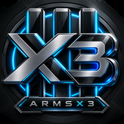

<p align="center">
  
</p>

<h1 align="center">ARMSX3 for iOS</h1>

<p align="center">
  Experimental ARM64/JIT PlayStation 3 emulation for iPhone and iPad.<br>
  A standalone feasibility build created for future EmuHub integration.
</p>

<p align="center">
  <a href="https://github.com/gr33k/ARMSX3/releases/tag/ios-prealpha-v0.35.0"></a>
  
  
  
  <a href="LICENSE"></a>
</p>

<p align="center">
  
</p>

> [!WARNING]
> This is an early pre-alpha. Compatibility, graphics, performance, input, and stability vary by title. Do not interpret a successful boot or menu as confirmed gameplay support.

## What Works

- A real ARM64/JIT ARMSX3 core on iOS 15+, with official PS3 firmware import.
- Local game import plus read-only PS3NetServ/NETISO streaming for ISO and extracted-folder libraries.
- Touch controls in portrait and EmuHub PS2-style controller rails in landscape.
- External MFi/PlayStation-compatible controller input through GameController.framework.
- Warm PPU/SPU/shader caches, runtime diagnostics, graphics-cache rebuild, and controlled Stop.

The active gameplay renderer is currently **Vulkan through MoltenVK**. A direct native-Metal RSX backend is under development but is not selectable in the public IPA and has no gameplay claim yet.

## Install

Download the current **TrollStore** IPA from the [V0.35 prerelease](https://github.com/gr33k/ARMSX3/releases/tag/ios-prealpha-v0.35.0), then open it in TrollStore.

- The app requires arm64 and iOS/iPadOS 15.0 or later.
- TrollStore officially supports iOS 14.0 beta 2 through 16.6.1, iOS 16.7 RC (`20H18`), and iOS 17.0. Because ARMSX3 requires iOS 15, its effective window starts at iOS 15.0. See [TrollStore's official compatibility statement](https://github.com/opa334/TrollStore#readme).
- iOS 16.7.x other than that RC and iOS 17.0.1+ are not supported by TrollStore.
- Official PS3 firmware and legally obtained games are required; neither is included.
- A normal free-development sideload does not preserve the JIT and memory entitlements used by this build.

## Tested Status

Physical observations below span development builds through V0.34 on an iPhone 13 Pro Max running iOS 15.3. V0.35 preserves the accepted V0.33 gameplay core and repairs the app-shell rotation lifecycle. Results are scene-specific, not broad compatibility ratings.

| Class | Current examples |
|---|---|
| Strong baselines | Bejeweled 3, Zuma, DuckTales Remastered, Toy Story Mania, Ratatouille, The Walking Dead |
| Promising / playable | LEGO Movie, Bound by Flame, Cars Race-O-Rama, Lost Planet |
| Runs with major issues | GTA V, Diablo III, LittleBigPlanet, Red Dead Redemption, Uncharted 1-3 |
| Boot/runtime blocked | BioShock Infinite, Kingdom Hearts, Sonic Generations, God of War, several encrypted or modified titles |

<details>
<summary><strong>Full physical test log</strong></summary>

| Title | Latest observed result |
|---|---|
| Bejeweled 3 | Gameplay works; first-run module compilation is lengthy. |
| Zuma | Gameplay works after title compilation. |
| DuckTales Remastered | Strong near-full-speed baseline; played through the first boss. |
| Toy Story Mania | Holds about 30 FPS; initial scene presentation can be delayed. |
| Ratatouille | Real 3D gameplay reached roughly 25-30 FPS. |
| The Walking Dead | Loads and runs around 30 FPS in the tested section. |
| LEGO Movie | User reports working gameplay on V0.34; long-run V0.35 retest pending. |
| Bound by Flame | Playable 3D baseline around 26-30 FPS with no initial visual corruption observed. |
| Cars Race-O-Rama | Holds about 30 FPS, with intermittent purple artifacts. |
| Lost Planet | Playable sections vary roughly 14-30 FPS; heavier combat dips. |
| LittleBigPlanet | Reached roughly 12-16 FPS, then later stalled at 0 FPS. |
| Diablo III | Reached 28-30 FPS with rendering glitches, then hung. |
| Grand Theft Auto V | Boots into 3D; roughly 6-30 FPS depending on scene/cache, with lighting artifacts, audio stutter, and long-run memory risk. |
| Red Dead Redemption | Boots, but heavy 3D remains roughly 2-12 FPS with severe rendering issues and crashes. |
| Uncharted: Drake's Fortune | Reaches gameplay around 8-12 FPS and remains crash-prone. |
| Uncharted 2 | Reaches media/gameplay paths but has severe color/render corruption, 0-FPS stalls, and crashes. |
| Uncharted 3 | Reaches gameplay but retains block artifacts, visual corruption, low FPS, and crashes. |
| BioShock Infinite | Passes the modified intro and module load, then reports a disc-read error. |
| Kingdom Hearts collection | Reaches version selection; tested choices stall at 0 FPS. |
| Hasbro Family Game Night | Reaches logos/menu after repeated boots, then black-screens or hangs. |
| Sonic Generations | Repeated runtime PPU compilation/0-FPS loop; no gameplay. |
| Sonic Unleashed | Did not reach gameplay. |
| Sonic the Hedgehog | Did not reach gameplay in the tested launch. |
| God of War | Reaches publisher logos, then stalls at 0 FPS. |
| Need for Speed: Carbon | Stops after the EA logo. |
| Gran Turismo 6 | Did not boot successfully. |
| Wolfenstein | Did not load successfully. |
| Twisted Metal | Boot stops before gameplay. |
| The Simpsons Game | Boot failed. |
| The Amazing Spider-Man 2 | NETISO source was rejected as an unsupported file/folder. |
| Teenage Mutant Ninja Turtles | NETISO source was rejected as an unsupported file/folder. |
| Star Wars: The Force Unleashed | Decryption failure. |
| Tomb Raider Trilogy | Decryption failure. |
| Cars Mater-National Championship | Did not reach gameplay. |
| XMB | Boots; occasional startup audio static remains under investigation. |

</details>

## Project Status

The immediate engineering priority is replacing runtime Vulkan command translation with a direct Metal RSX path while preserving the proven ARM64/JIT, NETISO, cache, input, and lifecycle work. Build success is not treated as gameplay proof; releases separate static/package verification from physical title qualification.

Detailed iOS evidence and open gates are maintained in [TEST_STATUS.md](platforms/ios/TEST_STATUS.md). Network-disc design is documented in [PS3_NETWORK_DISC_DESIGN.md](platforms/ios/PS3_NETWORK_DISC_DESIGN.md).

## Building

The iOS build targets arm64/iOS 15 and requires Xcode plus the pinned dependencies fetched by the scripts under `platforms/ios/scripts`.

```bash
JOBS=1 platforms/ios/scripts/build-core-ios15.sh
platforms/ios/scripts/build-core-ipa.sh
```

Keep builds serial on memory-constrained Macs. The generated IPA is ad-hoc signed with the required TrollStore entitlements and must still pass independent package inspection before release.

## Upstream and License

ARMSX3 for iOS is based on [ARMSX3](https://github.com/ARMSX2/ARMSX3) and [RPCS3](https://github.com/RPCS3/rpcs3). Most files are licensed under `GPL-2.0-only`; some components carry different compatible licenses. Check [LICENSE](LICENSE) and individual file headers for details.
